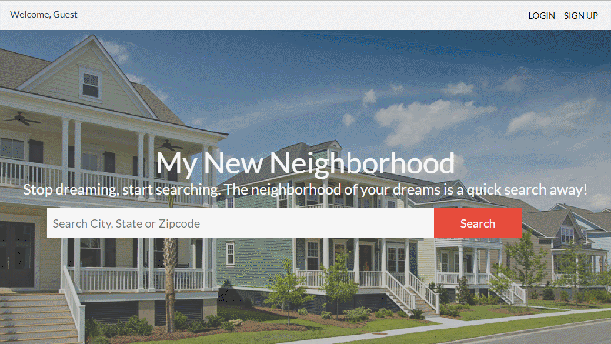
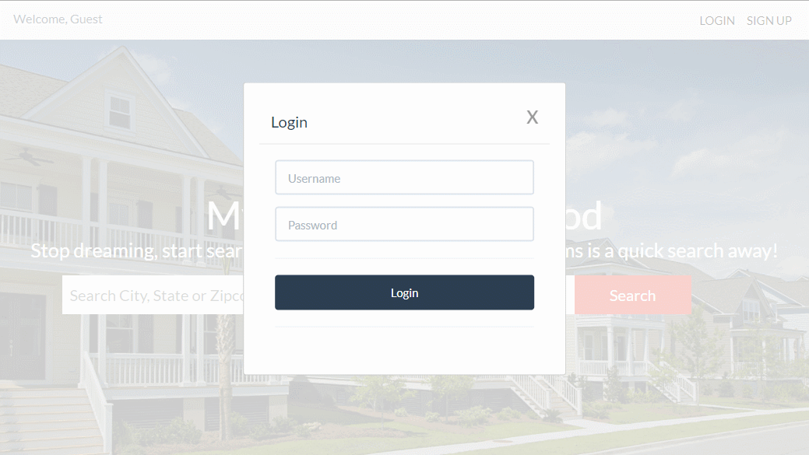
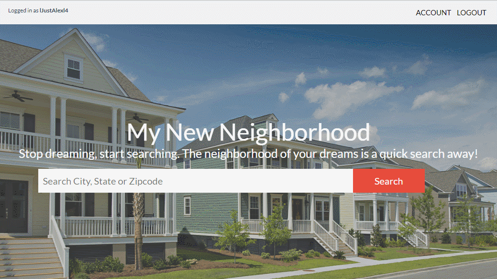

# My New Neighborhood
 
## Overview

My New Neighborhood is an app that allows users to enter any location in the US and receive census, schools, events, restaurants, moving company, and weather data in order to provide the user with a host of relevant information prior to a move. Simply enter either a city and state or zipcode into the search field, click submit, and you'll be presented with a dashboard of the information requested.

## App Link

[Heroku App Link](https://my-new-neighborhood-ap.herokuapp.com)

## Demos

## Signup (input validation):

### Login:

### Search:

### Full Search Results:

## Languages/Resources Used
- HTML
- CSS
- Bootstrap
- Responsive Design
- React
- JSX
- MongoDB
- Google Maps API
- US Census API 
- Eventful API
- Great Schools! API
- Yelp API
- Open Weather API

## Developers

* [**Matthew Beebe**](https://github.com/mattyb1980) - *AJAX Requests, APIs, React, JSX, CSS*
* [**Louis Hellinger**](https://github.com/louisHellinger) - *AJAX Requests, APIs, React, JSX, CSS, Responsive Design, Presentation*
* [**Komal Patel**](https://github.com/komalpatel96) - *Google Maps Implementation, AJAX Requests, APIs, React, JSX*
* [**Alexander Paulino**](https://github.com/alexanderpaulino) - *AJAX Requests, APIs, React, JSX, Troubleshooting*
